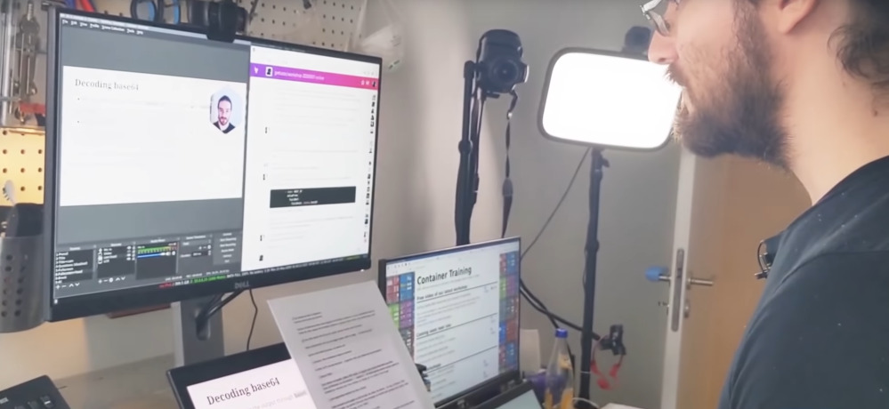

# Kubernetes Online Training

# Deploying micro-services   and traditional applications   with Kubernetes

# Training offered by Tiny Shell Script LLC

## DESCRIPTION

This is a **20-hour, hands-on online training** to get started with Kubernetes,
understand its concepts and its architecture, and learn how to leverage it
for your applications. It puts a strong emphasis on **“Cloud Native”** principles
and micro-services architectures, but is also suitable for traditional
monolithic applications.

**From theory to practice**: for the duration of the training, each student is
provided with their own, dedicated Kubernetes cluster, on which they
will implement numerous labs and exercises. The demo apps and code
samples feature components written in various languages like Node.js,
Python, or Ruby. These components communicate with each other over
load balancers. We will show you how to deploy and run that code
on Kubernetes clusters.

The curriculum is suitable to all Kubernetes deployment models:
**public cloud** (AKS, EKS, GKE…), **private cloud** (OpenStack…),
or **on-premises** (on your own servers in datacenters).

## TARGET AUDIENCE

Developers, sysadmins, ops, tech leads, architects.

## GOALS

After this training, you will know how to leverage Kubernetes to
improve the availability and scalability of your applications.

## COURSE STRUCTURE

The content is broken down into many modules (each running 10 to 30 minutes long).
Each module starts with a presentation of its concepts, followed by live demos
in a real environment. The students are then prompted to reproduce these demos
in their own environment, specially prepared for the training. This environment
is set up to be usable immediately (no time wasted installing local virtual
machines or setting up everyone's computer!), and it has all the features of
a typical deployment, allowing to freely go "off-script", tinker, and experiment.

## PRE-REQUIREMENTS

To get the most out of this training, you should be familiar with container
fundamentals. You don't need to be an expert, but ideally, you know how to build
a container image (for instance, with a Dockerfile), start a container, stop it,
and check its logs.

If you aren't familiar with these concepts, we recommend that you familiarize
yourself with e.g. Docker. There are many good resources out there to get
started with Docker; for instance [Play With Docker](https://training.play-with-docker.com/beginner-linux/).

Labs and exercises will be done on cloud virtual machines that we provide
for the duration of the training. Each student needs to have their own
computer, with a web browser and an SSH client.

The online learning platform requires a web browser. It doesn't require any
plugin or extra software installation. Firefox and Chrome are supported
on Linux, Mac, and Windows platforms.

Students don't need a microphone or webcam (although they can use one
if they wish). It is recommended to have multiple monitors, or a larger
monitor, so that the students can display simultaneously the video
stream (1080p), the live chat, the training materials, and the SSH client
to connect to their live environment.

<!--
*For private training sessions: it is necessary that the network
connectivity at the training venue allows outbound TCP connections
on arbitrary ports; not just 22/80/443.*
-->

## PERSONNEL

### Jérôme Petazzoni

Jérôme was part of the team that built, scaled, and operated the dotCloud PAAS, before that company became Docker. He worked seven years at the container startup, where he wore countless hats and ran containers in production before it was cool. He loves to share what he knows, which led him to give hundreds of talks and demos on containers, Docker, and Kubernetes. He trained thousands of people to deploy their apps in confidence on these platforms, and continues to do so as an independent consultant. He values diversity, and strives to be a good ally, or at least a decent social justice sidekick. He also collects musical instruments and can arguably play the theme of Zelda on a dozen of them.

*Jérôme is a Certified Kubernetes Administrator.*

## CURRICULUM

The curriculum below corresponds to a training of 20 hours, spread across
5 days, 4 hours per day. We found that this pace was ideal
for teams of Ops and SRE folks with on call duties.

Curious to see what our training materials look like?
No problem. The materials that we use for public training
and conference workshops are all available at
[container.training](https://container.training/).
For instance, you can see a recent presentation deck
that we recently delivered for a client [here](https://2021-09-zos.container.training).

K8S ARCHITECTURE

- Overview of Kubernetes features
- Control plane, worker nodes
- Using the kubectl CLI
- Declarative and imperative models

CREATING RESOURCES

- Pods and Deployments
- Viewing container logs
- Kubernetes networking
- ClusterIP, NodePort, LoadBalancer

SCALING

- Deployments and Replica Sets
- Daemon Sets
- Service selectors and load balancing
- Load balancing with labels

MANAGING RESOURCES

- YAML manifests
- Namespaces and scopes

REMOTE CLUSTERS

- Configurations and contexts
- Accessing internal services

ROLLOUTS, HEALTHCHECKS

- Upgrading a Deployment
- Upgrade strategies
- Healthchecks
- Readiness, liveness, startup probes

CONFIGURING APPS

- Pod volumes
- The downward API
- ConfigMaps
- Secrets
- Reconfiguration strategies

AUTH'N AND AUTH'Z

- Certs, tokens, and ServiceAccounts
- Role-Based Access Control

NEWORK POLICIES

- Isolating pods with network policies

INGRESS RESOURCES

- Handling inbound HTTP traffic
- Ingress controllers

CAPACITY MANAGEMENT

- CPU and RAM requests and limits
- LimitRanges and ResourceQuotas
- Metrics API
- Managing cluster capacity
- The Horizontal Pod Autoscaler

INSTALLING WITH HELM

- Helm concepts
- Charts, repositories, releases

AUTHORING HELM CHARTS

- Writing a basic chart
- Intro to Helm templates

## CONTACT US

For pricing and availability information, contact
**[jerome.petazzoni@gmail.com](mailto:jerome.petazzoni@gmail.com)**.

