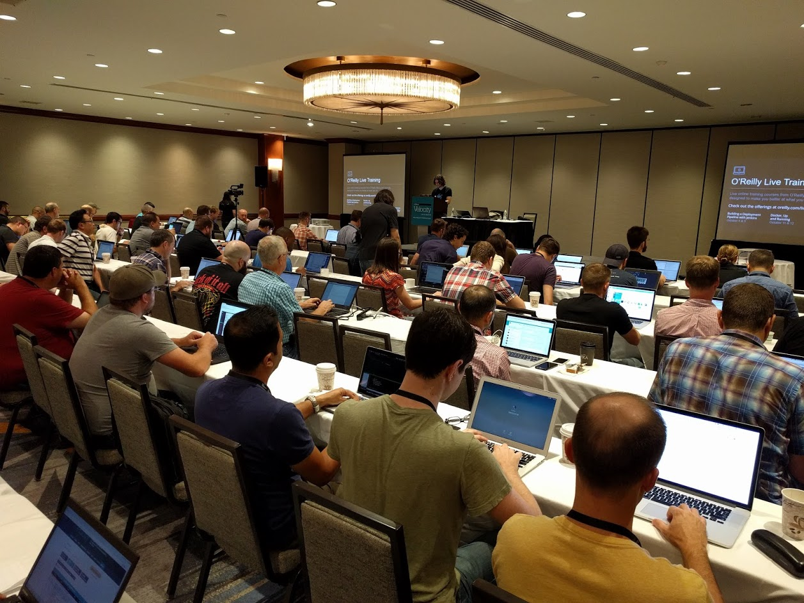

# Kubernetes Administrator Training

# All you need to know to operate Kubernetes clusters

# Training offered by Tiny Shell Script LLC

## DESCRIPTION

This is a **four-day, hands-on training** to learn and understand Kubernetes
concepts and architecture, and acquire the required skills to operate it
in production.

**From theory to practice**: for the duration of the training, each student is
provided with a set of dedicated cloud resources, on which they
will implement numerous labs and exercises. The demo apps and code
samples feature components written in various languages like Node.js,
Python, or Ruby. These components communicate with each other over
load balancers. We will show you how to deploy and run that code
on Kubernetes clusters. We will also learn how to build Kubernetes
clusters from scratch, in order to fully understand the role and
behaviors of each component of the **control plane** and **worker nodes**
of a cluster.

The curriculum is suitable to all Kubernetes deployment models:
**public cloud** (AKS, EKS, GKE…), **private cloud** (OpenStack…),
or **on-premises** (on your own servers in datacenters).

It covers the whole
[Certified Kubernetes Administrator (CKA) curriculum version 1.12](
https://github.com/cncf/curriculum/blob/master/CKA_Curriculum_V1.12.0.pdf)
(that's the most recent CKA curriculum as of February 2019), as
well as a few additions.

## TARGET AUDIENCE

The curriculum is primarily geared towards sysadmins and ops teams.
However, it is also appropriate for developers who need to be
self-reliant to set up and operate Kubernetes clusters, as well as
tech leads and architects who wish to acquire a deep knowledge
of Kubernetes to better utilize its most advanced features.

## GOALS

After this training, you will know how to set up, maintain, upgrade,
and perform day-to-day operations on Kubernetes clusters to
improve the availability and scalability of your applications.

This training will also teach you everything you need
to know in order to pass the Certified Kubernetes
Administrator (CKA) exam administered by the Cloud
Native Computing Foundation.

## COURSE STRUCTURE

The content is broken down into many modules (each running 10 to 30 minutes long).
Each module starts with a presentation of its concepts, followed by live demos
in a real environment. The students are then prompted to reproduce these demos
in their own environment, specially prepared for the training. This environment
is set up to be usable immediately (no time wasted installing local virtual
machines or setting up everyone's computer!), and it has all the features of
a typical deployment, allowing to freely go "off-script", tinker, and experiment.

## PRE-REQUIREMENTS

To get the most out of this training, you should be familiar with container
fundamentals. You don't need to be an expert, but ideally, you know how to build
a container image (for instance, with a Dockerfile), start a container, stop it,
and check its logs.

If you aren't familiar with these concepts, we recommend that you familiarize
yourself with e.g. Docker. There are many good resources out there to get
started with Docker; for instance [Play With Docker](https://training.play-with-docker.com/beginner-linux/).

Additionally, you should have work experience or training as a system administrator.
You know and understand how to use the UNIX command-line to navigate directories,
edit files, use SSH to access remote machines. You are familiar with networking
concepts like IP addresses and subnets. You know about TLS mutual authentication,
keys, and certificates.

Labs and exercises will be done on cloud virtual machines that we provide
for the duration of the training. Each student needs to bring their own
computer, with a web browser and an SSH client.

*For private training sessions: it is necessary that the network
connectivity at the training venue allows outbound TCP connections
on arbitrary ports; not just 22/80/443.*

## CLASSROOM SIZE

While we have successfully delivered workshops accommodating more
than 150 people at a time (at conferences like OSCON or Velocity),
for best results, we advise to cap classrooms to 20 persons.
If you need to train more than 20 students at a time, we can
accommodate you, but we strongly suggest to break down the class
in multiple groups.

For larger groups (more than 10 students) or groups with a broad
range of skills and profiles, we will bring at least one extra
assistant on site to make sure that everyone gets the best learning
experience regardless of their level and prior knowledge of containers.

## PERSONNEL

### Jérôme Petazzoni

Jérôme was part of the team that built, scaled, and operated the dotCloud PAAS, before that company became Docker. He worked seven years at the container startup, where he wore countless hats and ran containers in production before it was cool. He loves to share what he knows, which led him to give hundreds of talks and demos on containers, Docker, and Kubernetes. He trained thousands of people to deploy their apps in confidence on these platforms, and continues to do so as an independent consultant. He values diversity, and strives to be a good ally, or at least a decent social justice sidekick. He also collects musical instruments and can arguably play the theme of Zelda on a dozen of them.

*Jérôme is a Certified Kubernetes Administrator.*

## CURRICULUM

The following curriculum corresponds to a training of 4 days, running
at a steady pace. It includes numerous labs and exercises.

Curious to see what our training materials look like?
No problem. The materials that we use for public training
and conference workshops are all available at
[container.training](https://container.training/).
For instance, you can see
the entire presentation deck that we delivered at the
O'Reilly Velocity conference in October 2018 in New York City
[here](https://k8s2d.container.training/).

Kubernetes concepts

- What's an orchestrator?
- From pods to containers
- The control plane
- Declarative vs imperative models
- Kubernetes networking overview

First contact with a Kubernetes cluster

- Getting familiar with kubectl
- Deployments, replica sets, pods
- Listing and inspecting existing resources
- Running our first containers

Service discovery and load balancing

- Accessing pods through services
- Service types: ClusterIP, NodePort, LoadBalancer
- Headless services
- Using DNS for service discovery

Build, ship, and run a microservices app

- Creating deployments
- Exposing deployments internally and externally
- Scaling and load balancing
- Mitigating update impact with rolling deploys

Advanced deployment patterns

- Dynamically update load balancer backends with labels
- Traffic engineering with selectors and labels
- Adjusting rollout speed and resource usage

Using YAML to define resources

- Generating and exporting resource YAML
- Update the cluster state by editing YAML specs
- Example: creating a Daemon Set
- Knowing the gotchas of YAML
- Resources generating more resources with templates

Deep dive into Kubernetes architecture

- Behind the scenes of "kubectl run"
- Control plane components
- Node components
- Setting up a simple cluster

Networking

- Revisiting Kubernetes networking principles
- From kubenet to CNI
- How to pick network plugins
- Integration with external resources

Cluster setup and maintenance

- Managed options
- Distributions
- Cloud controller manager
- Static pods
- Upgrading a cluster
- Backup strategies

Day-to-day ops

- The Kubernetes dashboard
- Centralized logging
- Gathering cluster and application metrics
- Defining and using liveness and readiness healthchecks

Security

- Authentication and Authorization
- Authentication with certificates and tokens
- Authorization with Role-Based Access Control
- Granting permissions to Service Accounts
- Isolating components with Network Policies
- Pod security policies

Deploying multiple apps side by side

- Using namespaces
- Deploying multiple instances of the same app

Scaling

- Setting resource limits
- Cluster scaling
- Pod scaling
- Metrics server
- Autoscaling

Managing app complexity

- Review of app configuration mechanisms
- Managing configuration with config maps
- Managing sensitive information with secrets

Productivity tricks

- Managing access to multiple clusters
- Securely accessing internal services

The "ingress" resource

- Using "ingress" for HTTP traffic
- Different ingress implementations
- Advanced traffic engineering

Deploying stateful applications

- Declaring and using persistent volumes
- Abstracting storage systems with persistent volume claims
- Scaling or replication with stateful sets
- Deploying resilient stateful applications

Extending Kubernetes

- Custom resources definitions (CRDs)
- Operators
- Dynamic admission webhooks

## CONTACT US

For pricing and availability information, contact
**[jerome.petazzoni@gmail.com](mailto:jerome.petazzoni@gmail.com)**.
